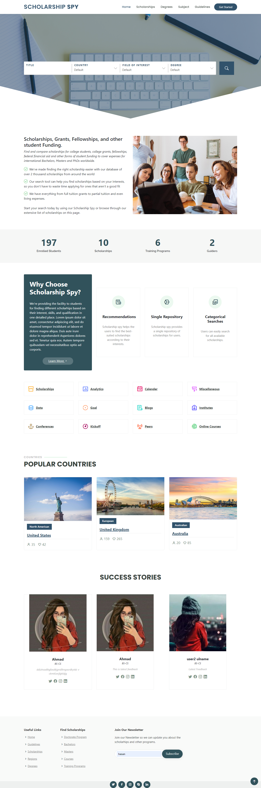
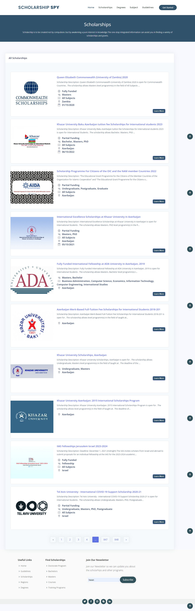
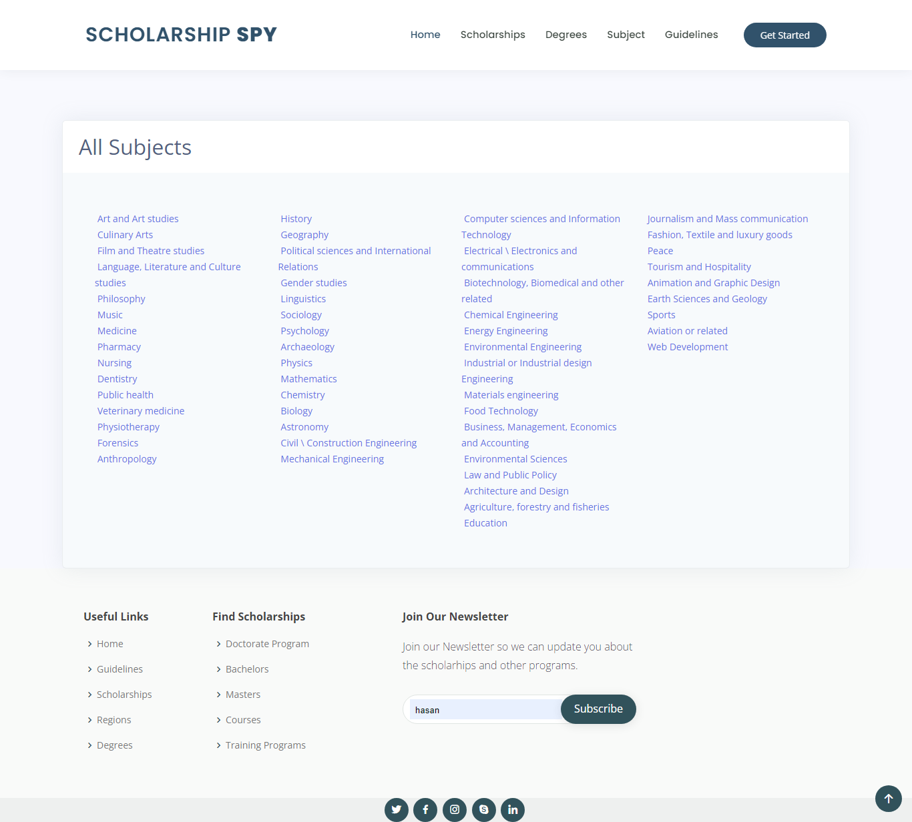

# My Django Portfolio Project

## Description

Scholarship SPY is scholarship recommendation system, It recommend scholarship based on student's choosen subjects.

## Table of Contents

- [Installation](#installation)
- [Usage](#usage)
- [Features](#features)
- [Technologies Used](#technologies-used)
- [Screenshots](#screenshots)
- [Contributing](#contributing)

## Installation

1. Make sure you have Python and Django installed. If not, you can download Python from <https://www.python.org/> and install Django using pip:

```
pip install django
```

2. Clone the repository to your local machine:

```
git clone <https://github.com/fatimarazzaq/Scholarship_Recommendation_System.git>
```

3. Create Virtual Env

```
python -m venv env
```

4. Download Requirements.txt

```
pip install -r requirements.txt
```

5. Navigate to the project directory:

```
cd project1
```

6. Install the required dependencies:

```
pip install -r requirements.txt
```

7. Apply database migrations:

```
python manage.py migrate
```

8. Run the development server:

```
python manage.py runserver
```

9. Access the application in your web browser at <http://localhost:8000/>

## Usage

- Visit the home page to view an overview of my portfolio.
- Browse through the projects section to see details about my projects, including descriptions, technologies used, and live links (if applicable).
- The skills section highlights the technologies and programming languages I'm proficient in.
- Use the contact page to get in touch with me for potential collaboration or job opportunities.

## Features

- Responsive and user-friendly interface.
- Project details and skillset management through the Django admin panel.
- Contact form for users to send messages directly to my email.
- Interactive UI elements and smooth navigation.

## Technologies Used

- Django: A high-level Python web framework
- HTML, CSS, JavaScript: Frontend development
- SQLite: Database
- Bootstrap: Frontend framework for responsive design
- Font Awesome: Fontawesome

## Screenshots






## Contributing

Contributions are welcome! If you find any issues or have suggestions for improvement, feel free to open an issue or submit a pull request.
